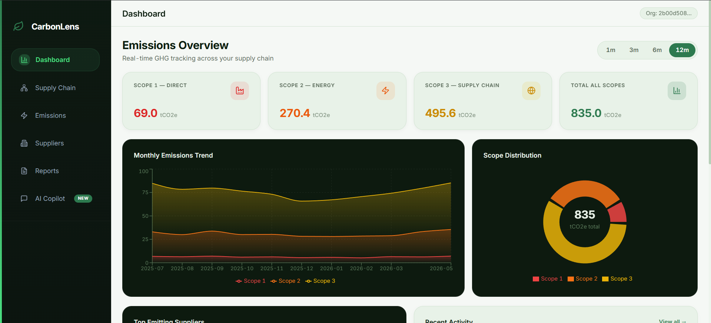
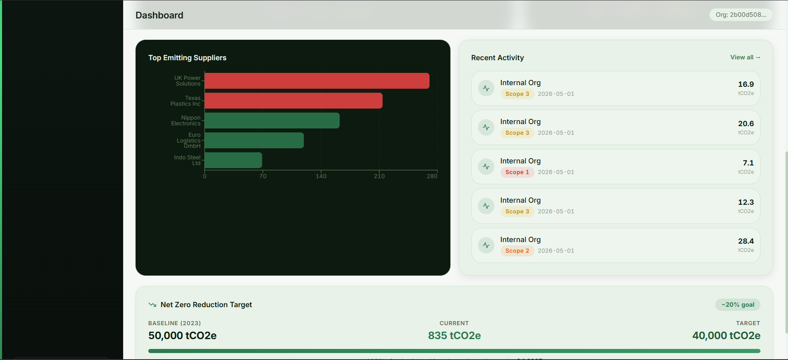
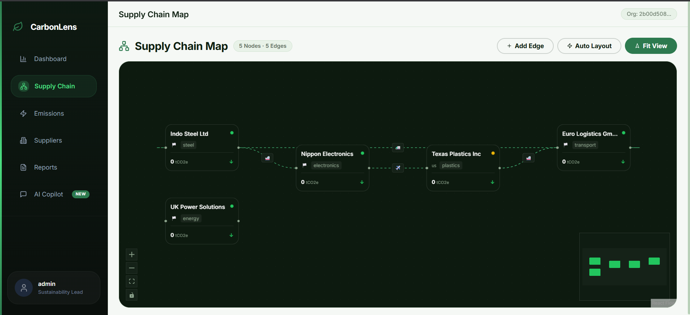
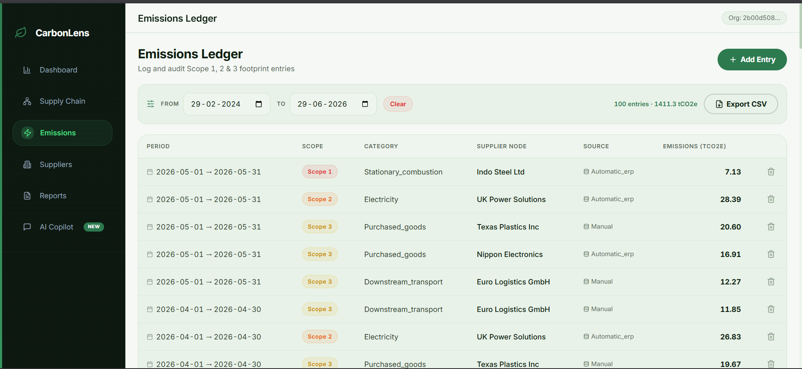
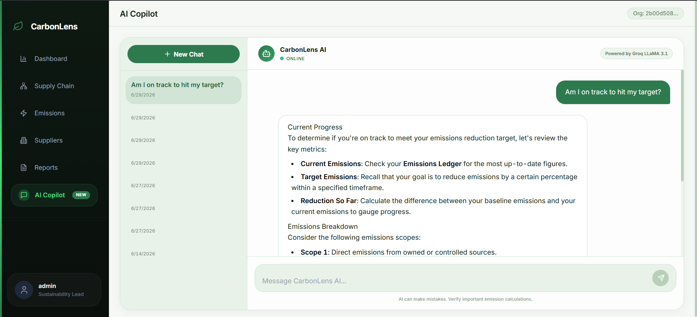
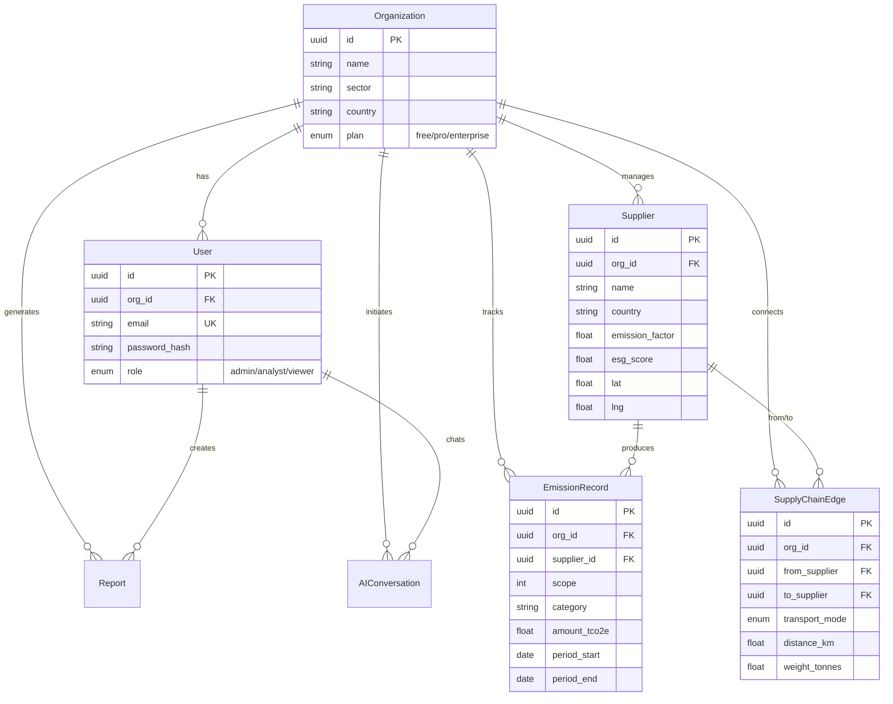

<div align="center">


<br/>

# 🌿 CarbonLens

### **AI-Powered Scope 3 Supply Chain Carbon Intelligence Platform**

> *Stop guessing your carbon footprint. Start optimizing it.*

[](https://carbonlens-app.vercel.app)
[](https://carbonlens-backend.onrender.com/docs)
[](https://github.com/stack-rishi/CarbonLens/actions)
[](LICENSE)

<br/>

**🏆 Deployed for OSF HackOne 2K26 — Final Round | Category: Sustainability & CleanTech**

**🧠 Team Last Brain Cell**

</div>

---

### 🚨 **EVALUATION ROUND 1 UPDATE TASK: COMPLETED** 🚨
> **Task:** Implement a Real-Time Carbon Compliance & Intelligent Alert System
> 
> **Implementation Highlights:**
> - **Compliance Engine**: Dynamically calculates a 100-point Sustainability Score weighted by reduction progress, supplier ESG ratings, emission trends, and strict threshold adherence.
> - **Intelligent Alerts**: Real-time evaluation background tasks that trigger on emission spikes (e.g., >15% month-over-month) or threshold breaches.
> - **Actionable Recommendations**: Rule-based generation of mitigation strategies (e.g., switching transport modes, renegotiating with high-intensity suppliers) tied to real data.
> - **PDF Compliance Reporting**: Generates automated, multi-page compliance reports featuring scope summaries and current-vs-previous month trend charts.
> - **Full-Stack Integration**: Integrated into the main dashboard, featuring a dedicated `Compliance Monitor` interface with Recharts gauges, severity badges, and interactive alert management.

---

## 🎯 Problem Statement & Solution Overview

### The Problem
**Scope 3 emissions account for 70-90% of a company's total carbon footprint** — yet they remain the hardest to track, buried across fragmented supplier data, complex logistics networks, and inconsistent reporting standards.
Today's sustainability teams rely on:
* ❌ **Manual spreadsheets** that are error-prone, static, and hard to audit.
* ❌ **Expensive enterprise tools** ($50K+/year) that are completely inaccessible to SMEs.
* ❌ **Disconnected supply chains** with zero visibility into supplier-specific ESG performance.
* ❌ **No actionability** — teams can calculate baseline numbers but cannot mathematically optimize logistics routes.

### The Solution
**CarbonLens** is an open-source, full-stack, AI-powered carbon intelligence platform that democratizes Scope 1, 2, and 3 footprint tracking. It enables organizations to map their entire supply chain, forecast future emissions, and use linear programming to optimize shipping logistics and supplier sourcing for minimum carbon impact — completely free.

---

## 🛠️ Tech Stack

| Layer | Technology | Purpose |
|:---|:---|:---|
| **Frontend** | React 18 · TypeScript · Tailwind CSS · shadcn/ui | Type-safe, accessible UI with 15+ Radix UI primitives |
| **State** | Zustand · TanStack React Query | Lightweight global state + server state caching and syncing |
| **Visualization** | Recharts · React Flow · Dagre | Interactive dashboard charts and automatic supply chain graph layouts |
| **Backend** | FastAPI · Python 3.11 · Poetry · Pydantic v2 | High-performance, async API with comprehensive validation |
| **Database** | Supabase (PostgreSQL) · Async SQLAlchemy | Relational storage with connection pooling (10+20) & RLS |
| **AI/ML** | Groq (LLaMA 3.3 70B) · Anthropic (Claude 3 Haiku) | Dual-LLM resilient pipeline with automatic mock fallback |
| **Optimization** | Google OR-Tools (GLOP LP Solver) | Linear programming for supplier allocation & transport minimization |
| **Reports** | ReportLab · Matplotlib | PDF report compilation engine with dynamic data charts |
| **Monitoring** | Sentry · structlog · SlowAPI | Real-time error capture, structured logging, and endpoint rate limits |
| **CI/CD** | GitHub Actions | Parallel jobs for backend (Ruff/Mypy/Pytest) & frontend (ESLint/Tsc) |

---

## 🚀 Installation & Setup Instructions

### Prerequisites
* **Node.js** ≥ 18
* **Python** ≥ 3.11 & **Poetry**
* **Git**
* A free **Supabase** account & a free **Groq** API Key

### 1. Clone the Repository & Configure Environment
```bash
git clone https://github.com/stack-rishi/CarbonLens.git
cd CarbonLens
cp .env.example .env
# Open .env and fill in your database details, Supabase keys, and Groq API keys.
```

### 2. Setup the Python Backend
```bash
cd backend
poetry install
poetry run alembic upgrade head
poetry run python seed.py          # Seeds the database with sample suppliers and 24 months of emissions
```

### 3. Setup the Frontend
```bash
cd ../frontend
npm install
```

### 4. Run the Development Environment
Run both backend and frontend servers simultaneously using the development launcher script in the root directory:
```bash
python scripts/dev.py
```
* 🌐 **Frontend URL**: `http://localhost:5173`
* 📡 **API Docs**: `http://localhost:8000/docs`
* 👤 **Demo Credentials**: `admin@acmecorp.com` / `password123`

---

## 🤖 AI Tools Disclosure Table

> **Mandatory disclosure as per OSF HackOne 2K26 Rules (Section 3)**

| AI Tool | Usage Area | How It Was Used |
|:---|:---|:---|
| **Claude (Anthropic)** | Code Assistance | Used for code generation, debugging, architecture decisions, and README documentation. All AI-generated code was reviewed, understood, and modified by team members before integration. |
| **Gemini (Google)** | Code Assistance | Used as an AI coding assistant for development support, code suggestions, and project scaffolding. |

> ⚠️ **Disclaimer**: All AI-assisted code was thoroughly reviewed, tested, and validated by team members. The core logic, architecture design, and problem-solving approach are original work by Team Last Brain Cell. AI tools were used as productivity aids, not as a substitute for understanding.

---

## 👥 Team Members & Roles

### **Team Last Brain Cell 🧠**

| Member | Role | Responsibilities |
|:---|:---:|:---|
| **Rishi Sharma** | Full Stack Developer | Backend architecture, database schema, AI/ML integration, optimizer service, DevOps |
| **Anshika Roy** | Full Stack Developer | Frontend UI/UX, component development, React Flow integrations, data visualizations |

---

## 🖼️ Screenshots & Demo Link

### 🎥 Demo Video
👉 **[Watch the Live Product Demo Video (Google Drive)](https://drive.google.com/file/d/1VDceA1mDvpucPV-FvQ2ctrSOFE7xFGOd/view?usp=drive_link)**

### 🌐 Live Links
* 💻 **Web Application**: [https://carbonlens-app.vercel.app](https://carbonlens-app.vercel.app)
* ⚙️ **Backend API Endpoint**: [https://carbonlens-backend.onrender.com](https://carbonlens-backend.onrender.com)
* 🏥 **Backend Swagger Docs**: [https://carbonlens-backend.onrender.com/docs](https://carbonlens-backend.onrender.com/docs)

### 📸 Product Screenshots

#### 1. Scope 1, 2 & 3 Emissions Dashboard
*Provides an aggregated bird's-eye view of your entire carbon footprint over a rolling 12-month period.*


#### 2. Scope-based Monthly Trends & Net Zero Goal Tracker
*Visualizes monthly emission patterns across Scopes and monitors compliance towards target Net Zero goals.*


#### 3. Interactive Supply Chain Mapping
*Graph representation of upstream and downstream suppliers using React Flow, heatmapped by carbon intensity with auto-layout positioning.*


#### 4. Audit-ready Emissions Ledger
*Comprehensive tabular view of raw emission records with advanced date-range filters, scope grouping, and CSV export capabilities.*


#### 5. AI Carbon Co-pilot Chat
*Trained sustainability AI assistant grounded in your database and aligned with international environmental frameworks.*


---

## ⚙️ Advanced Technical Design & System Architecture

### System Flow Diagram
```
┌─────────────────────────────────────────────────────────────────────┐
│                         FRONTEND (Vercel)                          │
│  React 18 • TypeScript • Tailwind CSS • shadcn/ui • Zustand        │
│  ┌──────────┐ ┌───────────┐ ┌──────────┐ ┌──────────────────────┐  │
│  │Dashboard │ │Emissions  │ │Suppliers │ │ Supply Chain Graph   │  │
│  │  Page    │ │  Ledger   │ │  Manager │ │  (React Flow+Dagre)  │  │
│  └──────────┘ └───────────┘ └──────────┘ └──────────────────────┘  │
│  ┌──────────┐ ┌───────────┐ ┌──────────┐                          │
│  │AI Chat   │ │  Reports  │ │Onboarding│                          │
│  │ Co-Pilot │ │   Page    │ │  Wizard  │                          │
│  └──────────┘ └───────────┘ └──────────┘                          │
├────────────────────────┬────────────────────────────────────────────┤
│     Axios + Bearer     │  TanStack React Query (cache/invalidation)│
│     Token Auth         │  Sentry Error Tracking                    │
├────────────────────────┴────────────────────────────────────────────┤
│                       BACKEND API (Render)                         │
│  FastAPI • Python 3.11 • Poetry • Async SQLAlchemy • Alembic       │
│  ┌─────────────────────────────────────────────────────────────┐   │
│  │                    Middleware Stack                          │   │
│  │  Request Logging (structlog) → Security Headers → UUID IDs  │   │
│  │  Rate Limiting (SlowAPI) → CORS                             │   │
│  └─────────────────────────────────────────────────────────────┘   │
│  ┌──────────┐ ┌───────────┐ ┌──────────┐ ┌──────────────────────┐ │
│  │Auth API  │ │Emission   │ │Supplier  │ │Supply Chain API      │ │
│  │/register │ │  API      │ │  API     │ │  /graph /edges       │ │
│  │/login    │ │/records   │ │/CRUD     │ │  /forecast /optimize │ │
│  │/me       │ │/summary   │ │/bulk     │ │                      │ │
│  └──────────┘ │/trend     │ │/optimize │ └──────────────────────┘ │
│               └───────────┘ └──────────┘                          │
│  ┌──────────┐ ┌───────────┐ ┌──────────────────────────────────┐  │
│  │Report    │ │AI Service │ │  Optimizer Service               │  │
│  │Generator │ │Groq→Claude│ │  Google OR-Tools GLOP LP Solver  │  │
│  │(ReportLab│ │→MockChain │ │  Multi-modal Route Comparison    │  │
│  │+Matplotlib│ └───────────┘ └──────────────────────────────────┘  │
│  └──────────┘                                                     │
├───────────────────────────────────────────────────────────────────┤
│                    DATABASE (Supabase)                             │
│  PostgreSQL + asyncpg • Connection Pool (10+20) • RLS             │
│  7 Tables: Organization, User, Supplier, EmissionRecord,          │
│  SupplyChainEdge, Report, AIConversation                          │
└───────────────────────────────────────────────────────────────────┘
```

### Key Technical Innovations
1. **Supply Chain Graph Intelligence**: Integrates Dagre auto-layout nodes with dynamic trend arrows mapping emission intensity changes over rolling periods.
2. **OR-Tools LP Sourcing Optimization**: Solves multi-variable sourcing problems using Google's Linear Programming solver to minimize carbon footprint while satisfying production demands.
3. **Resilient AI Failover Chain**: Routes prompts dynamically through Groq (LLaMA 3.3) with instant fallback to Anthropic (Claude 3 Haiku) and structured mocks.
4. **Verified GHG Calculations**: Automated transport emissions (weight × distance × vehicle factor), energy emissions (kWh × national grid factor), and materials calculations.

### Database ER Schema


---

## 🏆 Hackathon Evaluation Alignment

| Evaluation Criteria | Mark Distribution | CarbonLens Implementation |
|:---|:---:|:---|
| **Innovation & Originality** | /25 | Combining linear programming optimization, interactive flow layout charts, and resilient multi-provider AI grounding. |
| **Technical Implementation** | /20 | Async FastAPI, SQLAlchemy integration, connection pooling, production-grade Docker, CI/CD pipelines, security headers, SlowAPI. |
| **Problem-Solving Relevance** | /15 | Offers a zero-cost Scope 3 mapping utility to allow mid-market enterprises and SMEs to calculate footprints without enterprise costs. |
| **Completeness of the Build** | /15 | 8 functional pages, CSV bulk import engines, PDF report compiling, interactive supply chain maps, optimization tools. |
| **UI/UX & Functionality** | /10 | Beautiful CSS customization, tailored dark theme styling, Radix primitive components, toast notifications, animated wizard interfaces. |
| **Presentation & Q&A** | /10 | Deployed live web application, complete API docs, and comprehensive README documentation. |
| **Scalability & Impact** | /5 | Stateless design suited for horizontal scaling, lightweight global stores, edge network deployment. |

---

## 📋 Docker Deployment

For containerized backend deployments:
```bash
# Build multi-stage optimized image
docker build -f docker/Dockerfile.backend -t carbonlens-api .

# Run
docker run -p 8080:8080 --env-file .env carbonlens-api
```

---

<div align="center">

**Built with 💚 for a sustainable future by Team Last Brain Cell**

</div>
